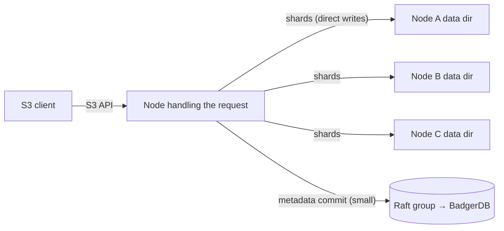

# Hamster Architecture

This document describes how Hamster is designed to work. It is the narrative companion to the [Architecture Decision Records](adr/), which capture why each choice was made and what was rejected.

> **Status: design document.** Hamster is at v0 and the system described here is being built, not shipped. Everything below is the target design; nothing is a guarantee until it exists and survives the simulation harness.

## The shape of the system

A Hamster deployment is a cluster of nodes. Each node runs the same single binary and stores data in its local data directory. There are no external services: no ZooKeeper, no etcd, no separate database. Coordination is embedded — metadata lives in BadgerDB replicated by Raft, and object data is erasure coded directly across nodes.

The single most important structural decision is that **metadata and object data travel different paths**:

- **Metadata** — the object to shard mapping, bucket configuration, the namespace, version lists — is small and consistency critical. It is stored in BadgerDB on each node and replicated through Raft, giving strong consistency via quorum.
- **Object data** — the erasure coded shards — is large and goes nowhere near the Raft log. Shards are written directly to the chosen nodes. Durability comes from the erasure coding spread across failure domains, not from consensus.

Pushing object bytes through Raft would make the consensus log the bandwidth bottleneck for every upload and triple-write data that erasure coding already protects more cheaply. Keeping the log small (metadata only) is what lets a quorum stay fast. See [ADR-0005](adr/0005-metadata-badgerdb-raft.md).

## Request paths

### PUT

1. The client sends an S3 PUT to any node. The object lands in the write buffer — which we nickname the pouch, the way a hamster fills its cheeks before stashing food away.
2. The node builds the framed object stream — chunked, optionally compressed, optionally encrypted ([DATA-STREAM.md](DATA-STREAM.md)) — and erasure codes it into `k` data shards plus `m` parity shards (Reed Solomon). Shards are ciphertext when encryption is on, so every later process (repair, rebalance, scrub) works without keys.
3. The placement function maps the object's partition to a set of nodes — a pure local computation: `hash(key)` picks the partition, and the cluster layout (replicated metadata, already in every node's local store) names the nodes. No lookup, no round trip. The shards are written **directly** to those nodes' data directories — never through Raft.
4. Once a quorum of shards is durable on disk, the node atomically commits one small metadata record through Raft: key, version ID, size, checksums, and shard locations.
5. The PUT is acknowledged. If the metadata commit never happens, the shards are orphaned garbage to be collected, not a visible object — the metadata commit is the linearization point.

### GET

1. The client sends a GET to any node.
2. The node reads the key's version list from metadata (a strongly consistent read) and resolves the requested or current version to its shard locations.
3. It fetches any `k` of the `k+m` shards from their nodes, decodes, verifies checksums, and streams the object back. Missing or corrupt shards are tolerated up to `m` losses; reads work even while the cluster is degraded.

## Durability: erasure coding, not replication

Each object is split into `k` data shards and `m` parity shards. Any `k` shards reconstruct the object, so the cluster tolerates the loss of any `m` shards per object. Storage overhead is `(k+m)/k` — for example 4+2 costs 1.5× instead of the 3× of triple replication, with better loss tolerance.

Two rules govern placement:

- **The failure domain is the node, not the disk.** No two shards of one object land on the same node, so losing a whole node costs at most one shard per object.
- **Self healing repair.** When a node is lost, reconstruction rebuilds the missing shards from the surviving ones onto healthy capacity. Repair is a first class background process from v0. Background scrubbing against bit rot is a later sophistication — planned, not initial.

See [ADR-0003](adr/0003-erasure-coding-over-replication.md). The concrete `k+m` profiles, the acknowledgment rule, and the small-object and single-node stories are designed in [ERASURE-CODING.md](ERASURE-CODING.md) ([ADR-0015](adr/0015-storage-profiles.md)).

## Placement: partitions, not fixed pools

Objects map to **partitions** by consistent hashing. The partition count is fixed at creation — a few thousand, generously overprovisioned — and is **never resized**. Each partition is assigned to a set of nodes by the **cluster layout**, which is versioned state in metadata.

Adding capacity changes the layout, not the data format: a new layout version reassigns some partitions to the new node, and rebalancing migrates those partitions' shards. Objects are **never re-encoded** during rebalance — shards just move. Because the layout is versioned with old→new transition tracking, reads can find data that is mid migration by consulting both assignments.

Placement also understands failure domains above the node: every node carries an auto-detected **host** label and an operator-set **zone** label (an availability zone, a rack), and shards spread as evenly as possible across zones, then hosts, then nodes — so a node-per-disk deployment on three servers survives a whole-server loss, not just disk losses. The node-distinct rule is the hard invariant; spreading above it is an objective, with the achieved tolerance reported in `cluster status`. See [ADR-0016](adr/0016-failure-domain-hierarchy.md).

v0 keeps the rest deliberately simple: manually triggered rebalance, with capacity-weighted assignment arriving in the placement release (v0.4) so mixed disk sizes stop stranding capacity. Automatic rebalancing comes later as an additive feature within the same model — the partition abstraction does not change, only the assignment policy does. See [ADR-0004](adr/0004-partitioned-placement.md).

## Metadata: BadgerDB replicated by Raft

Metadata is stored locally in BadgerDB (an embedded Go key-value store — no external database to operate) and replicated through Raft for strong consistency.

- **v0: a single Raft group** for all metadata. This is the simplest thing that proves the system, and metadata is small enough that one group suffices at v0 scale. Voting membership is capped at five, chosen zone-spread; every node beyond that replicates metadata and serves traffic as a **learner**, so a hundred-node cluster keeps a five-way quorum ([ADR-0017](adr/0017-raft-voter-cap-learners.md)).
- **Later: multi-raft.** Metadata shards across many partitions, each with its own Raft group, for horizontal metadata scale. The v0 design treats this as an additive evolution, not a rewrite.

### Consistency model

- Metadata operations are strongly consistent: Raft plus quorum.
- Objects are **immutable blobs** — written once, never edited in place. This removes most conflict cases that plague mutable stores.
- Overwriting a key creates a new version; the "current version" pointer for a key resolves inside the metadata transaction, so concurrent overwrites serialize cleanly.

The concrete schema — the protobuf records and the BadgerDB keyspace — is designed in [METADATA.md](METADATA.md) ([ADR-0014](adr/0014-metadata-keyspace-design.md)).

## Node communication

Three kinds of traffic flow in a cluster, all point-to-point — there is no message bus or broker:

1. **Client traffic**: the S3 API, HTTP against any node.
2. **Control plane**: Raft messages and small intra-cluster RPCs, on a dedicated intra-cluster port.
3. **Data plane**: bulk shard streams — writes, reads, repair, and rebalance transfer between specific node pairs.

Control plane and data plane both run over mutual TLS, always — a cluster CA is minted at `cluster init`, nodes get certificates at join, and there is no plaintext cluster mode ([ADR-0022](adr/0022-cluster-mtls.md)). The TLS layer lives in the transport adapter, below the simulator seam.

**Any node is a gateway — clients never track the leader.** S3 clients are deliberately dumb (an endpoint and credentials), so whichever node a client contacts coordinates that request; spreading clients across nodes is an operator choice (DNS round-robin, a load balancer, or one node — all fine). The Raft leader is involved only where consensus is: the gateway erasure codes and writes shards directly itself, leaderlessly, and just the small metadata proposal is forwarded internally to the leader for commit — a few hundred bytes of a gigabyte upload. Strongly consistent reads work from any node, voters and learners alike, via Raft's read-index (the leader quorum-confirms the commit index; the gateway serves from local state once caught up). Leader failover is an internal, sub-second event that clients experience as a retried request, not a reconnection.

**No bus, by design.** Raft assumes a lossy, reordering network and implements its own retries and ordering above the transport, so a bus's delivery guarantees are redundant beneath it. The data plane wants streams between two known nodes, not published messages. And an embedded broker (NATS, for example, which is pure Go and Apache 2.0 and so passes the dependency rules on paper) would mean operating a second distributed system inside the first — its own routing, membership, and failure modes — while its internal goroutines and timers could never sit behind the simulator seam ([SIMULATION.md](SIMULATION.md)). The transport stays dumb: deliver bytes to a known peer, report failure, nothing else.

**Discovery is not a subsystem — membership is metadata.** The Raft configuration plus the cluster layout ([ADR-0004](adr/0004-partitioned-placement.md)) are the authoritative record of who is in the cluster, replicated like all metadata. A new node joins by contacting any existing node (`hamster cluster join <addr>`), which proposes a membership change through Raft; from then on every node learns its peers from the replicated layout. Health checking runs among known members and feeds repair and the upgrade interlock. No gossip protocol, no external registry.

The production wire protocol (gRPC versus hand-rolled framed protobuf over TCP — protobuf payloads either way, per [ADR-0008](adr/0008-versioned-formats-rolling-upgrades.md)) is deliberately undecided until the real transport adapter is built; it lives behind the Transport seam and contains no logic, which is what makes the choice low-stakes.

## Versioning and object lock

Versioning is not a feature bolted onto a single-record-per-key store. From day one, metadata models **every key as an ordered list of versions** — even when versioning is disabled and the list holds exactly one entry. Enabling versioning on a bucket is therefore a natural state change, not a schema migration. The model includes delete markers, version IDs, and `ListObjectVersions`.

**Version IDs are UUIDv7** (time sortable per RFC 9562), generated via `google/uuid`'s `NewV7` and kept as `[16]byte` so the forthcoming standard library uuid type is a one line swap. Sortable IDs give chronological ordering in the index for free and better write locality. Intra-millisecond monotonicity is handled explicitly so writes in the same millisecond still order correctly. See [ADR-0007](adr/0007-uuidv7-version-ids.md).

**Object lock and WORM retention** are first class: retention in GOVERNANCE and COMPLIANCE modes, plus legal holds. Object lock requires versioning, because a lock applies to a specific version. The hard rule: **COMPLIANCE mode is enforced even against administrators, with no override path**. GOVERNANCE mode is bypassable with the right permission; COMPLIANCE is not, by anyone, ever. See [ADR-0006](adr/0006-versioning-and-object-lock.md).

## Formats and upgrades

Hamster treats format evolution as a design problem, not an afterthought:

- **Every on disk and on wire structure carries a version field** and uses additively evolvable serialization (protobuf). Fields are only ever added, never removed or repurposed. New code must always read old formats.
- **The cluster layout is versioned state.** Topology changes create a new layout version with old→new transition tracking, so reads find data mid migration.
- **Zero downtime rolling upgrades** (a v1 commitment): upgrade one node at a time, staying within EC fault tolerance. A health check interlock refuses to take a node down while the cluster is already degraded, so quorum is never broken.
- **Breaking changes follow expand then contract** across releases: first teach every node to read the new format, then start writing it once all can read it, then drop the old.
- **Upgrade policy: cross at most one major version at a time.**
- **A cluster version with feature gates** keeps features that require all nodes dormant until an administrator finalizes the version bump after every node is upgraded.

During v0.x, formats may change between releases — that window exists precisely to get the formats right. v1.0 commits to a Go style promise: v1 formats remain readable forever. See [ADR-0008](adr/0008-versioned-formats-rolling-upgrades.md) and [ADR-0010](adr/0010-v1-compatibility-policy.md).

## Testing: durability trust is earned

Two mechanisms carry the correctness story:

1. **Deterministic simulation testing**, in the style of FoundationDB and TigerBeetle. The whole cluster runs inside a simulated world with controllable clocks and injected network partitions, disk failures, and message reordering — all reproducible from a single seed. This is the **primary correctness mechanism and is foundational from v0**, which is why the code conventions require every source of nondeterminism (time, randomness, network, disk) to sit behind a simulator-controllable interface. It also makes future contributions safe: a change must survive thousands of simulated failure schedules before it merges.
2. **End to end upgrade tests**: stand up a cluster at version N, write data, roll node by node to N+1, and assert no data loss and continuous availability throughout.

See [ADR-0009](adr/0009-deterministic-simulation-testing.md) for the decision and [SIMULATION.md](SIMULATION.md) for the harness design.
